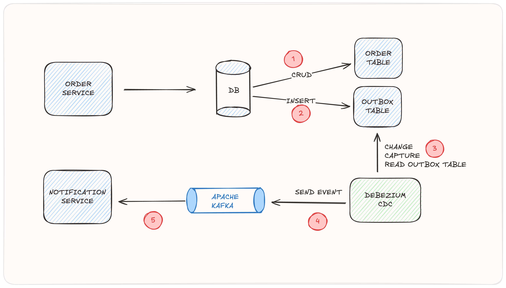

# Spring Boot Transactional Outbox Pattern with Debezium and Kafka

## Transactional Outbox Pattern

The transactional outbox pattern is a design pattern used to ensure reliable message delivery between distributed systems. It is particularly useful in microservices architectures where services need to communicate asynchronously.

**Why Do We Need It?**

1. **Reliability**: Guarantees that messages are not lost even in the case of system failures or crashes.
2. **Consistency**: Ensures that messages are sent only once, maintaining the consistency of the distributed system.
3. **Decoupling**: Allows services to operate independently and communicate via messages without direct coupling.

**How It Works**

1. **Transactional Outbox Table**: Messages to be sent are stored in a database table (outbox table) as part of the same transaction that modifies the state of the application.
2. **Polling/Dispatching**: A separate process or service reads the outbox table and sends the messages to the intended recipients.
3. **Message Delivery**: Messages are delivered reliably, and once delivered, they are marked as sent in the outbox table.

## Debezium

**Debezium** is an open-source distributed platform for change data capture (CDC). It is used to capture and stream changes from databases to various applications, making it easier to synchronize data across systems.

**Key Features:**

1. **Change Data Capture**: Debezium captures changes (inserts, updates, deletes) in real-time from databases and streams them to other systems.
2. **Integration**: It integrates seamlessly with Apache Kafka, which helps in streaming data in real-time and processing it with other systems and applications.
3. **Support for Multiple Databases**: Debezium supports various databases such as MySQL, PostgreSQL, MongoDB, SQL Server, and more.
4. **Scalability**: Designed to work in distributed environments, Debezium scales to handle large volumes of data and high throughput.

**How It Works:**

1. **Database Connector**: Debezium uses connectors that interface with the database and capture changes. These connectors interact with the database’s transaction logs or change streams.
2. **Event Streaming**: The captured changes are converted into event records and published to Kafka topics. Applications consuming these topics can then process or store the data as needed.
3. **Configuration and Monitoring**: Debezium provides configuration options for tuning performance and monitoring the state of connectors.

**Use Cases:**

- **Data Synchronization**: Keep data in sync between multiple databases or between a database and an application.
- **Event Sourcing**: Capture and store state changes for applications following an event-driven architecture.
- **Real-Time Analytics**: Stream changes to analytics platforms for real-time insights.

Debezium helps in building real-time data pipelines and supports various integration patterns by streaming database changes to systems like Kafka, making it a powerful tool for modern data architectures.

-------------------------

This project demonstrates the implementation of the Transactional Outbox Pattern using Spring Boot, Debezium, and Apache Kafka. It includes two main services:

- **Order Service**: Responsible for creating orders and writing events to the Outbox table.
- **Notification Service**: Consumes events from Kafka to process notifications.

The pattern ensures that changes made in the database (like creating an order) are reliably communicated to other services, even in the case of failures or retries.

## Architecture

1. **Order Service**:
    - Handles order creation.
    - Writes events to the Outbox table within the same transaction as the order creation.

2. **Debezium**:
    - Monitors changes to the Outbox table.
    - Streams changes to Kafka.

3. **Kafka**:
    - Acts as the message broker.
    - Receives events from Debezium and delivers them to the Notification Service.

4. **Notification Service**:
    - Consumes events from Kafka.
    - Processes notifications based on the events received.

5. **Scheduler**:
    - Periodically checks the Outbox table for unprocessed records.
    - Retries sending records to Kafka if the previous attempt failed.